#  :card_file_box: dante.wiki
My personal wikipedia written with Nuxt.js, using the nuxt/content module as database architecture.

_The design is inspired by my first programming memory from 1998 when I was active in an online community called [skunk.nu](https://en.wikipedia.org/wiki/Skunk.nu)._ :skunk:
## :pencil2: Instructions

Rename `env.example` to `.env`.

```bash
# Install dependencies.
$ npm install

# Build for production and launch server.
$ npm run build

# Generate static project.
$ npm run generate

# Serve with hot reload at localhost:3000.
$ npm run dev
```

## :paperclip: Tools
- Base: [Nuxt.js](https://nuxtjs.org/)
- Formatter: [Prettier](https://prettier.io/)
- Git-based Headless CMS: [nuxt/content](https://content.nuxtjs.org/)
- Hosting: [Netlify](https://www.netlify.com/)
- Illustrations: [Dante Mogrim](https://www.dante.wiki/)
- Sitemap: [nuxt/sitemap](https://sitemap.nuxtjs.org/)
- Syntax Highlighter: [PrismJS](https://prismjs.com/)
- Styling: [CSS](https://www.w3.org/Style/CSS/Overview.en.html) + [Tailwind CSS](https://tailwindcss.com/)

## Backlog

<details><summary>📚 WIP</summary>

- [ ] Improve A11Y measurements.
- [ ] Improve responsiveness.
- [x] RSS feed.
- [ ] TypeScript implementation.


</details>

## :man_technologist: Creator
- [Dante Mogrim](https://www.dante.wiki/)

## :page_with_curl: License
[](https://lbesson.mit-license.org/)
